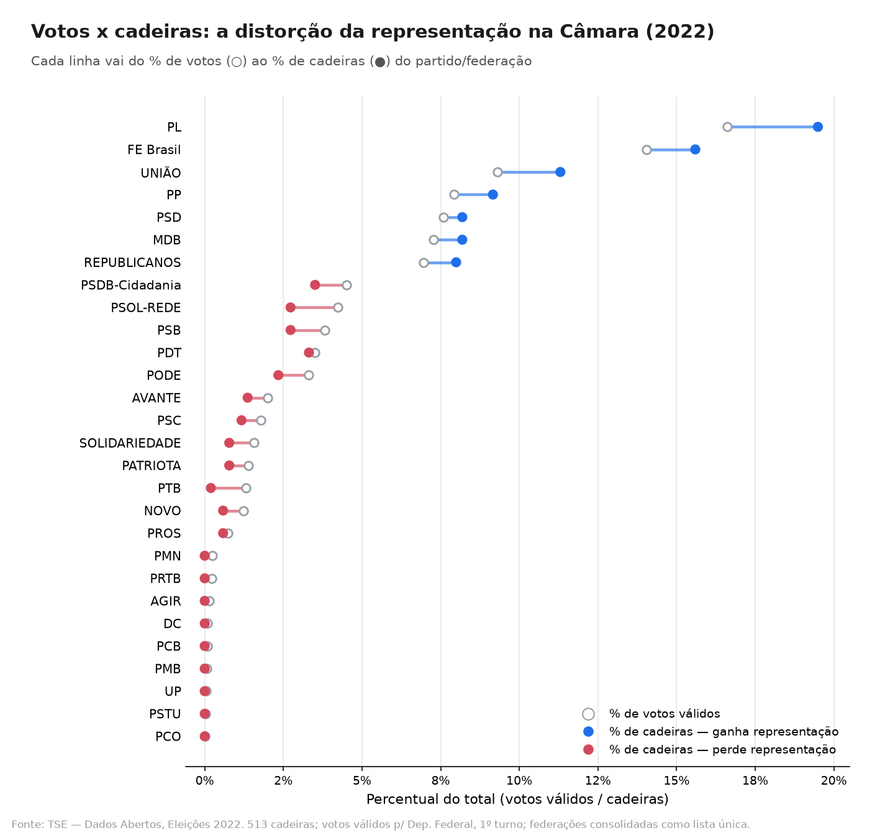

# Relatório

> [!CAUTION]
>
> - Você <ins>**não pode utilizar ferramentas de IA para escrever este relatório**</ins>.

## Identificação

- **Nome**: <mark>`João Vítor Leffa Lummertz`</mark>
- **Cartão UFRGS:** <mark>`00577893`</mark>

## Dados utilizados

> [!IMPORTANT]
>
> - Os dados utilizados devem ser informados como **links** para as fontes originais.
> - Se houver mais de um conjunto de dados, liste todos separadamente.
> - Para cada conjunto de dados, inclua também uma **descrição curta** explicando os dados.

**Dataset 1**: [Votação por partido para deputado federal nas eleições de 2022](https://sig.tse.jus.br/ords/dwapr/r/seai/sig-eleicao-arquivo/conjuntos-de-dados?p10_nm_modulo=resultado&cs=1Brfzlba5M5hEkO4v5h43NlnB8RP8Ih00RtWGNzALTirZArEk6UZWhjYrpQuTA9NZORsIH9Cs2UI-X-yZs3K22Q)
    * **Descrição curta**: Utilizei este dataset para obter o total de votos nacional por partido (votos nominais + legenda).

É possível obter o arquivo `votacao_partido.csv` por meio da seguinte configuração de filtros:
```
Gerar o conjunto de dados de
Votação partido do ano de 2022
no formato de arquivo
CSV (pt-BR)
retornando valor de
Quantidade de votos de legenda válidos,
Quantidade de votos nominais válidos e
Quantidade de votos válidos
agrupado por
Cargo,
Sigla da federação,
Sigla partido,
Ano de eleição,
Coligação,
Composição da federação,
Região,
Turno,
UF e
Zona
e filtrado por
Cargo igual a "Deputado Federal"
```

**Importante**: essa é a forma que o site representa o sumário dos filtros e dados selecionados antes da geração do CSV. **Não é um prompt**.


**Dataset 2**: [Relação completa de candidatos nas eleições de 2022](https://dadosabertos.tse.jus.br/dataset/candidatos-2022)
  * **Descrição curta**: Utilizei esse dataset para obter a quantidade de cadeiras obtidas por cada partido

## Código-fonte da visualização

> [!IMPORTANT]
>
> - Indique abaixo onde está, dentro deste repositório, o código-fonte usado para gerar a visualização.

- **Arquivo principal**: <mark>`plot.ipynb`</mark>
- **Arquivos complementares (se houver)**: <mark></mark>

## Imagem da visualização gerada

> [!IMPORTANT]
>
> - Insira aqui uma imagem da visualização criada por você. Troque `imagem-da-visualizacao.png` pelo caminho correto do arquivo no repositório. 
> - Se você criou alguma visualização interativa, então descreva aqui como acessá-la. Por exemplo, se for uma página HTML, coloque o link, ou se for uma visualização 3D, descreva como compilar e executar o código. 



## Descrição da visualização

### Legenda (*caption*)

> [!IMPORTANT]
>
> - Escreva um texto curto explicando como interpretar a visualização. Descreva os elementos visuais, eixos, cores, símbolos ou interações relevantes.
> - Este texto seria a legenda (*caption*) que acompanharia a figura em uma publicação, por exemplo.

É um gráfico de halteres, em que cada linha representa um partido (ou federação). No eixo X, temos o percentual do total, em escala igual para votação e cadeiras. O círculo preenchido representa a % de votos obtidos, e o círculo branco a quantidade de cadeiras obtidas. Quando a cor da linha é azul, significa que o partido é sobrerepresentado referente aos seus votos. O contrário é verdade para as linhas vermelhas. Quanto maior o comprimento da linha, maior a distorção.  

### Conclusão demonstrada pela visualização

> [!IMPORTANT]
>
> - Escreva uma conclusão curta sobre os dados com base na visualização.
> - Explique qual insight, padrão ou tendência pode ser observado.

Com base no gráfico, é possível observar que o atual sistema eleitoral brasileiro tende a beneficiar partidos grandes em detrimento dos pequenos e médios. Uma das possíveis causas para isso é a [falta de proporcionalidade entre população e tamanho das bancadas estaduais](https://g1.globo.com/politica/noticia/2025/05/05/bancadas-dos-estados-na-camara-veja-os-tamanhos-atuais-e-compare-com-o-que-defende-o-stf-e-o-que-preve-proposta-em-debate.ghtml), beneficiando a capilaridade de legendas maiores.